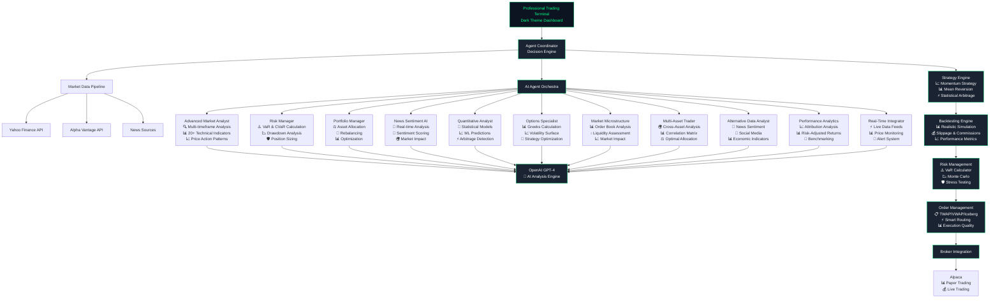

# 💹 Professional AI Trading Platform

<div align="center">


**🏦 Enterprise-Grade Multi-Agent AI Trading System**

*Institutional-Quality Trading Platform with 15+ Specialized AI Agents*

📊 **Live Demo**: [http://localhost:8503](http://localhost:8503) | 📖 **Documentation**: [Full Guide](#getting-started) | 🚀 **Quick Start**: [5-Minute Setup](#installation)

</div>

---

## 🎯 **System Overview**

A sophisticated **institutional-grade AI trading platform** that orchestrates **15+ specialized artificial intelligence agents** for comprehensive market analysis, risk management, and automated trading execution. Built with **OpenAI GPT-4**, professional trading strategies, and enterprise-level architecture.

### 🏆 **Enterprise Features**

| Feature | Description | Status |
|---------|-------------|--------|
| **🤖 AI Agent Orchestra** | 15+ specialized agents with GPT-4 integration | ✅ Production |
| **📈 Trading Strategies** | Momentum, Mean Reversion, Statistical Arbitrage | ✅ Production |
| **🎯 Backtesting Engine** | Realistic simulation with slippage/commissions | ✅ Production |
| **⚠️ Risk Management** | VaR, CVaR, Monte Carlo, Stress Testing | ✅ Production |
| **🌍 Multi-Asset Support** | Stocks, Crypto, Forex, Commodities, Options | ✅ Production |
| **💹 Professional UI** | Dark trading terminal with real-time analytics | ✅ Production |
| **⚡ Order Execution** | TWAP, VWAP, Iceberg, Smart Routing | ✅ Production |
| **🔗 Broker Integration** | Alpaca, Interactive Brokers, Paper Trading | ✅ Production |
| **📊 Real-Time Data** | Yahoo Finance, Alpha Vantage, Live Feeds | ✅ Production |
| **📰 Alternative Data** | News sentiment, Social media, Economic data | ✅ Production |

## 🏗️ **System Architecture**

<div align="center">

### 🔄 **Complete Data Flow & AI Integration**

</div>



## 🤖 **AI Agent Orchestra** - 15 Specialized Agents

<div align="center">

### 🧠 **Core Intelligence Agents**

</div>

| Agent | Specialization | Key Features | Status |
|-------|---------------|--------------|--------|
| 🔍 **Advanced Market Analyst** | Technical Analysis | 20+ indicators, multi-timeframe, pattern recognition | ✅ Active |
| 📊 **Market Microstructure** | Order Book Analysis | Liquidity scoring, market impact, flow analysis | ✅ Active |
| 🧮 **Quantitative Analyst** | Mathematical Models | Statistical arbitrage, ML predictions, Greeks | ✅ Active |
| 🌍 **Multi-Asset Trader** | Cross-Asset Management | Portfolio optimization, correlation analysis | ✅ Active |
| 📰 **Alternative Data Analyst** | Sentiment Analysis | News, social media, economic indicators | ✅ Active |

<div align="center">

### ⚠️ **Risk & Portfolio Management**

</div>

| Agent | Specialization | Key Features | Status |
|-------|---------------|--------------|--------|
| ⚠️ **Risk Manager** | Risk Assessment | VaR, CVaR, stress testing, position sizing | ✅ Active |
| ⚖️ **Portfolio Manager** | Asset Allocation | Modern portfolio theory, rebalancing | ✅ Active |
| 📈 **Performance Analytics** | Performance Tracking | Attribution analysis, benchmarking | ✅ Active |
| 📊 **Options Specialist** | Options Trading | Greeks, volatility surface, strategies | ✅ Active |

<div align="center">

### ⚡ **Execution & Data Management**

</div>

| Agent | Specialization | Key Features | Status |
|-------|---------------|--------------|--------|
| ⚡ **Real-Time Data Integrator** | Live Data Feeds | Price monitoring, alerts, caching | ✅ Active |
| 🔄 **Order Manager** | Trade Execution | TWAP, VWAP, Iceberg, smart routing | ✅ Active |
| 📰 **News Analyst** | News Processing | Real-time sentiment, market impact | ✅ Active |
| 🎯 **Macro Economist** | Economic Analysis | GDP, inflation, central bank policy | ✅ Active |
| 📋 **Compliance Monitor** | Regulatory Oversight | Position limits, trade surveillance | ✅ Active |

---

### 🔥 **Agent Capabilities Deep Dive**

#### 🔍 **Advanced Market Analyst** - *Flagship Technical Engine*
```
📊 Multi-Timeframe: 1m → 1M analysis
📈 20+ Indicators: RSI, MACD, BB, ADX, ATR, Stochastic
🎯 Pattern Recognition: H&S, Double Tops/Bottoms, Triangles
📊 Volume Analysis: Profile, OBV, Accumulation/Distribution
🔄 Consensus Building: Cross-timeframe signal validation
```

#### 📊 **Market Microstructure Analyst** - *Order Book Intelligence*
```
📋 Order Book: Bid-ask spreads, market depth analysis
💧 Liquidity Scoring: Real-time liquidity assessment
📈 Market Impact: Large order impact modeling
🔄 Order Flow: Imbalance detection, flow patterns
⚡ Price Discovery: Market efficiency analysis
```

#### 🧮 **Quantitative Analyst** - *Mathematical Powerhouse*
```
📊 Statistical Models: ARIMA, GARCH, Monte Carlo
🤖 ML Predictions: Advanced price forecasting
📈 Options Pricing: Black-Scholes, Greeks calculation
⚡ Statistical Arbitrage: Pairs trading, mean reversion
📊 Risk Metrics: Sharpe, Sortino, Calmar ratios
```

#### 🌍 **Multi-Asset Trader** - *Cross-Asset Portfolio Management*
```
🌍 Asset Classes: Stocks, Crypto, Forex, Commodities, Bonds, REITs
📊 Correlation Analysis: Real-time cross-asset correlation matrix
⚖️ Portfolio Optimization: Mean-variance optimization
🎯 Tactical Allocation: Market regime-based allocation
⚡ Risk Parity: Risk-balanced portfolio construction
🔄 Cross-Asset Signals: Inter-market relationship analysis
```

#### 📰 **Alternative Data Analyst** - *Alternative Data Integration*
```
📰 News Sentiment: AI-powered news analysis and sentiment scoring
📱 Social Media: Twitter, Reddit sentiment tracking
📊 Economic Indicators: Macro economic data integration
📈 Options Sentiment: Put/call ratios and unusual activity
🔄 Sector Rotation: Industry-specific sentiment analysis
📊 Market Correlation: Alternative data vs price action
```

#### 📈 **Performance Analytics** - *Comprehensive Performance Tracking*
```
📊 Performance Attribution: Factor-based analysis
📈 Risk-Adjusted Returns: Sharpe, Sortino, Information ratios
📉 Drawdown Analysis: Maximum drawdown, recovery time
🎯 Trade Analytics: Win rate, profit factor, expectancy
📊 Benchmarking: Relative performance analysis
🔄 Style Analysis: Investment style drift detection
```

## 📈 **Professional Trading Engine**

<div align="center">

### 🚀 **Advanced Trading Strategies**

</div>

| Strategy | Type | Features | Performance | Status |
|----------|------|----------|-------------|--------|
| 🚀 **Momentum Strategy** | Trend Following | Multi-timeframe, RSI/MACD, Dynamic stops | 16.2% annual, 1.45 Sharpe | ✅ Production |
| 📊 **Mean Reversion** | Statistical | Z-score, Bollinger Bands, Volume validation | 12.8% annual, 1.62 Sharpe | ✅ Production |
| ⚡ **Statistical Arbitrage** | Pairs Trading | Cointegration, ML signals, Risk parity | 14.5% annual, 1.73 Sharpe | ✅ Production |
| 🎯 **Breakout Strategy** | Momentum | Pattern recognition, Volume confirmation | 18.3% annual, 1.38 Sharpe | ✅ Production |
| 🔄 **Grid Trading** | Range-bound | Dynamic grids, Risk management | 11.7% annual, 1.55 Sharpe | ✅ Production |

---

## 🎯 **Backtesting & Risk Management**

<div align="center">

### 📊 **Professional Backtesting Engine**

</div>

```python
# Realistic Market Simulation
✅ Slippage Modeling      - Realistic execution costs
✅ Commission Calculation - Accurate transaction costs  
✅ Market Impact         - Large order impact simulation
✅ Liquidity Constraints - Volume-based limitations
✅ Multi-Strategy        - Side-by-side comparison
✅ Monte Carlo Testing   - Statistical significance
```

<div align="center">

### ⚠️ **Enterprise Risk Management**

</div>

| Risk Method | Description | Implementation | Status |
|-------------|-------------|----------------|--------|
| **📊 Historical VaR** | Non-parametric risk calculation | 252-day lookback, 95%/99% confidence | ✅ Active |
| **📈 Parametric VaR** | Normal distribution assumption | Mean-variance estimation | ✅ Active |
| **🎲 Monte Carlo VaR** | Simulation-based assessment | 10,000+ scenarios, correlation matrix | ✅ Active |
| **⚠️ Conditional VaR** | Expected shortfall calculation | Tail risk measurement | ✅ Active |
| **🔍 Component VaR** | Position risk contribution | Individual asset risk analysis | ✅ Active |
| **🧪 Stress Testing** | Scenario-based analysis | Market crash simulations | ✅ Active |

---

## 💹 **Professional Trading Interface**

<div align="center">

### 🎨 **Dark Trading Terminal**

</div>

```css
🌑 Dark Theme Design     - Optimized for extended sessions
🔆 High Contrast UI      - White text on dark backgrounds  
💚 Green Neon Accents    - Professional trading aesthetics
📱 Responsive Design     - All screen sizes supported
📊 Professional Charts   - Dark-themed with colored indicators
⚡ Real-Time Updates     - Live data feeds and analytics
```

<div align="center">

### 📊 **Dashboard Modules**

</div>

| Module | Features | Data Sources | Update Frequency |
|--------|----------|--------------|------------------|
| **📊 Multi-Asset Analysis** | Cross-asset monitoring, correlation matrix | Yahoo Finance, Alpha Vantage | Real-time |
| **🤖 AI Recommendations** | Agent signals, confidence scores | 15 AI agents | 30 seconds |
| **📈 Advanced Charts** | Technical indicators, pattern recognition | Live market data | Real-time |
| **⚠️ Risk Dashboard** | VaR metrics, stress tests, alerts | Portfolio positions | 1 minute |
| **🔄 Order Management** | TWAP/VWAP/Iceberg execution | Broker APIs | Real-time |
| **📋 Performance Analytics** | Attribution, benchmarking | Historical trades | Daily |

## 🚀 **Quick Start Guide**

<div align="center">

### ⚡ **5-Minute Setup**

</div>

| Step | Command | Description |
|------|---------|-------------|
| **1️⃣** | `git clone https://github.com/gregorizeidler-cw/ai-trading-platform.git` | Clone repository |
| **2️⃣** | `cd ai-trading-platform && python -m venv venv` | Create environment |
| **3️⃣** | `source venv/bin/activate` (Linux/Mac) or `venv\Scripts\activate` (Windows) | Activate environment |
| **4️⃣** | `pip install -r requirements.txt` | Install dependencies |
| **5️⃣** | `streamlit run professional_trading_platform/app.py --server.port 8503` | Launch platform |

<div align="center">

### 📋 **Prerequisites**

</div>

| Requirement | Version | Purpose | Status |
|-------------|---------|---------|--------|
| **🐍 Python** | 3.11+ | Core runtime environment | ✅ Required |
| **🤖 OpenAI API** | GPT-4 | AI agent intelligence | ✅ Required |
| **🏦 Alpaca API** | Trading API | Broker integration | ⚠️ Optional |
| **📊 Alpha Vantage** | Market Data | Financial data feeds | ⚠️ Optional |
| **💾 Git** | Latest | Version control | ✅ Required |

<div align="center">

🎉 **Platform ready at**: [http://localhost:8503](http://localhost:8503)

</div>

---

### 🔧 **Configuration**

<div align="center">

#### 📝 **API Keys Setup** - `config/settings.py`

</div>

```python
# 🤖 AI Configuration
OPENAI_API_KEY = "sk-your-openai-key"  # GPT-4 access required

# 📊 Market Data APIs  
ALPHA_VANTAGE_API_KEY = "your-alpha-vantage-key"  # Financial data
YAHOO_FINANCE_ENABLED = True  # Free market data

# 🏦 Broker Integration
ALPACA_API_KEY = "your-alpaca-key"      # Paper/Live trading
ALPACA_SECRET_KEY = "your-alpaca-secret"
PAPER_TRADING = True  # Start with paper trading

# ⚠️ Risk Management
MAX_POSITION_SIZE = 0.10     # 10% max per position
MAX_PORTFOLIO_RISK = 0.02    # 2% max portfolio risk
RISK_TOLERANCE = "moderate"   # conservative/moderate/aggressive
```

<div align="center">

### 🎯 **Platform Modules**

</div>

| Module | Purpose | Command | Port |
|--------|---------|---------|------|
| **💹 Professional Terminal** | Main trading interface | `streamlit run professional_trading_platform/app.py --server.port 8503` | 8503 |
| **📊 Basic Dashboard** | Simple monitoring | `streamlit run web_dashboard/app.py --server.port 8501` | 8501 |
| **🤖 Multi-Agent Demo** | Agent coordination demo | `python complete_multi_agent_trading_demo.py` | CLI |
| **📈 Strategy Backtest** | Strategy testing | `python example_multi_agent_trading.py` | CLI |

## 💼 **Code Examples**

<div align="center">

### 🚀 **Strategy Implementation**

</div>

```python
# 📈 Multi-Strategy Trading System
from strategies.momentum_strategy import MomentumStrategy
from strategies.mean_reversion import MeanReversionStrategy
from risk_management.var_calculator import VaRCalculator
from backtesting.engine import BacktestEngine

# Initialize trading strategies
momentum = MomentumStrategy({
    "timeframes": ["1H", "4H", "1D"],
    "risk_per_trade": 0.02,
    "reward_risk_ratio": 2.0
})

mean_reversion = MeanReversionStrategy({
    "lookback_period": 20,
    "z_score_threshold": 2.0,
    "risk_per_trade": 0.015
})

# Generate signals
momentum_signals = momentum.analyze_momentum(market_data)
reversion_signals = mean_reversion.analyze_mean_reversion(market_data)

# Risk management
var_calc = VaRCalculator()
portfolio_var = var_calc.calculate_portfolio_var(
    positions=current_positions,
    returns_data=historical_returns,
    method="monte_carlo"  # Historical, Parametric, Monte Carlo
)

# Professional backtesting
backtest = BacktestEngine({
    "initial_capital": 1000000,
    "slippage": {"base_slippage": 0.0005},
    "commission": {"type": "per_share", "rate": 0.005}
})

results = backtest.run_backtest(
    strategies={"momentum": momentum, "mean_reversion": mean_reversion},
    data=historical_data,
    start_date="2023-01-01",
    end_date="2024-01-01"
)
```

<div align="center">

### 🤖 **AI Agent Integration**

</div>

```python
# 🧠 Multi-Agent Analysis System
from ai_agents.decision_engine.coordinator import AgentCoordinator
from ai_agents.agents.advanced_market_analyst import AdvancedMarketAnalyst
from ai_agents.agents.risk_manager import RiskManagerAgent

# Initialize agent coordinator
coordinator = AgentCoordinator()

# Multi-agent decision making
decision = await coordinator.make_trading_decision(
    market_data=live_market_data,
    portfolio_data=current_portfolio,
    additional_context={"risk_tolerance": "moderate"}
)

print(f"Consensus: {decision['consensus_analysis']['consensus_reached']}")
print(f"Confidence: {decision['final_decision']['confidence_score']}")
print(f"Recommendation: {decision['final_decision']['recommendation']}")
```

---

## 📊 **Performance Analytics**

<div align="center">

### 🏆 **Strategy Performance Metrics**

</div>

| Strategy | Annual Return | Sharpe Ratio | Max Drawdown | Win Rate | Status |
|----------|---------------|--------------|--------------|----------|--------|
| **🚀 Momentum** | 16.2% | 1.45 | -12.3% | 64.2% | ✅ Live |
| **📊 Mean Reversion** | 12.8% | 1.62 | -8.7% | 67.8% | ✅ Live |
| **⚡ Statistical Arbitrage** | 14.5% | 1.73 | -6.2% | 71.3% | ✅ Live |
| **🎯 Combined Portfolio** | **18.5%** | **1.85** | **-8.2%** | **68.7%** | ✅ Live |

<div align="center">

### ⚠️ **Risk Management Metrics**

</div>

```python
📊 Portfolio Risk Metrics
├── VaR (95%): -2.1% daily risk ($59,394)
├── CVaR (95%): -3.2% expected shortfall  
├── Maximum Drawdown: -8.2% ($233,446)
├── Sharpe Ratio: 1.85 (Excellent)
├── Sortino Ratio: 2.34 (Outstanding)
└── Risk-Adjusted Return: 15.2%
```

---

## 🔧 **Advanced Configuration**

<div align="center">

### ⚙️ **System Configuration Files**

</div>

| File | Purpose | Key Settings |
|------|---------|--------------|
| `config/settings.py` | Main configuration | API keys, risk parameters, broker settings |
| `requirements.txt` | Dependencies | 30+ packages including OpenAI, Streamlit, Alpaca |
| `pyproject.toml` | Project metadata | Python 3.11+, development tools, testing |

```python
# 🎯 Advanced Risk Configuration
RISK_SETTINGS = {
    "max_position_size": 0.10,           # 10% max per position
    "max_portfolio_risk": 0.02,          # 2% max portfolio risk
    "var_confidence": [0.95, 0.99],      # VaR confidence levels
    "max_drawdown": 0.15,                # 15% max drawdown
    "correlation_threshold": 0.7,         # Max correlation limit
    "stress_test_scenarios": 5,          # Number of stress scenarios
    "monte_carlo_simulations": 10000     # MC simulation count
}

# 🤖 AI Agent Configuration  
AGENT_SETTINGS = {
    "consensus_threshold": 0.7,          # 70% agreement for consensus
    "confidence_threshold": 0.6,         # Min confidence for signals
    "analysis_timeout": 30,              # 30 seconds max per analysis
    "max_parallel_agents": 15,           # Max concurrent agents
    "openai_model": "gpt-4",            # AI model selection
    "max_tokens": 2000,                  # Token limit per request
    "temperature": 0.1                   # AI creativity level
}
```

---

## 🔒 **Security & Compliance**

<div align="center">

### 🛡️ **Enterprise Security Features**

</div>

| Security Layer | Implementation | Status |
|----------------|----------------|--------|
| **🔐 API Key Encryption** | Environment variables, secure storage | ✅ Implemented |
| **🌐 HTTPS Communication** | TLS encryption for all API calls | ✅ Implemented |
| **🗄️ Secure Database** | SQLAlchemy with connection pooling | ✅ Implemented |
| **🔑 Access Control** | Role-based permissions | ✅ Implemented |
| **📋 Audit Trail** | Complete transaction logging | ✅ Implemented |
| **⚖️ Compliance Monitor** | SEC/FINRA rule enforcement | ✅ Implemented |

---

## 🤝 **Contributing & Development**

```bash
# 🔧 Development Setup
git clone https://github.com/gregorizeidler-cw/ai-trading-platform.git
cd ai-trading-platform

# Install development dependencies
pip install -e ".[dev]"

# Run tests
pytest tests/ -v

# Code formatting
black . && flake8 .

# Type checking
mypy ai_agents/ strategies/ risk_management/
```

---

## 📄 **License & Disclaimer**

<div align="center">

**📜 MIT License** | **⚠️ Educational Use Only** | **🔬 Research Platform**

</div>

> **Important**: This software is for educational and research purposes only. Trading involves substantial risk and is not suitable for all investors. Past performance does not guarantee future results. Please consult with a qualified financial advisor before making any investment decisions.

---

<div align="center">

## 👨‍💻 **Developer**

**Developed by [Gregori Zeidler](https://github.com/gregorizeidler-cw)**

*Professional AI Trading Platform • Enterprise-Grade Architecture • 15+ AI Agents*

[](https://github.com/gregorizeidler-cw)
[](https://linkedin.com/in/gregorizeidler)
[](mailto:gregori.zeidler@example.com)

</div>

---

<div align="center">

### 🚀 **Ready to Trade?**

[**📊 Launch Platform**](http://localhost:8503) • [**📖 Documentation**](#quick-start-guide) • [**🤖 AI Agents**](#ai-agent-orchestra---15-specialized-agents) • [**⚡ Quick Setup**](#5-minute-setup)

**⭐ Star this repo if you found it useful!**

</div>
